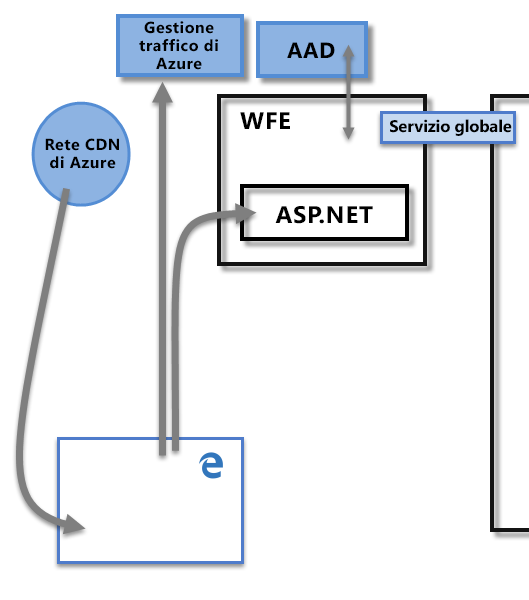
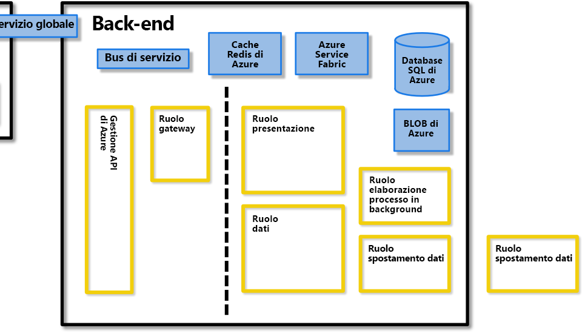
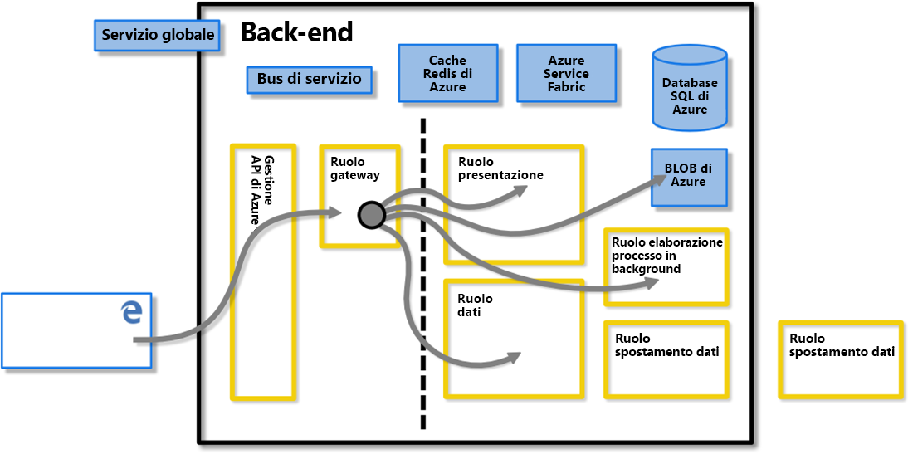
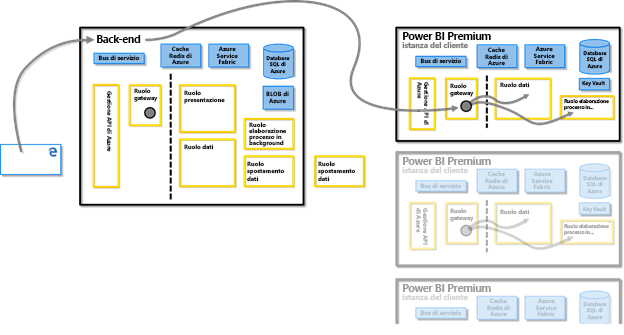
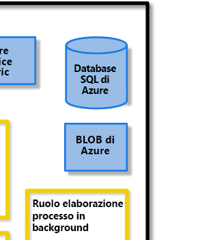
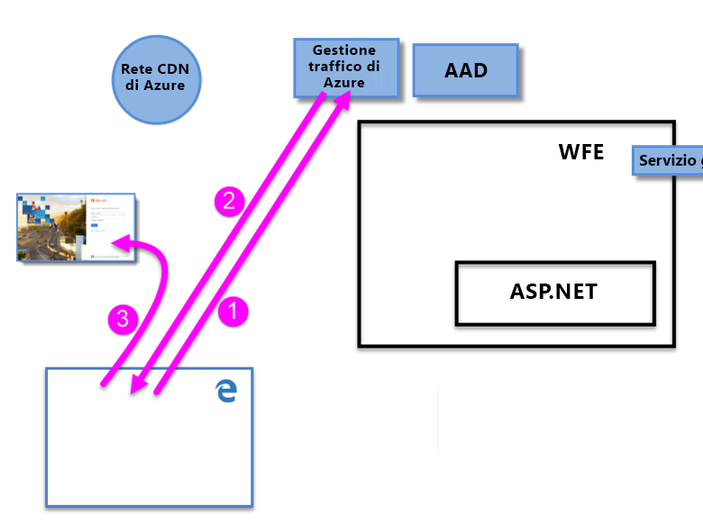
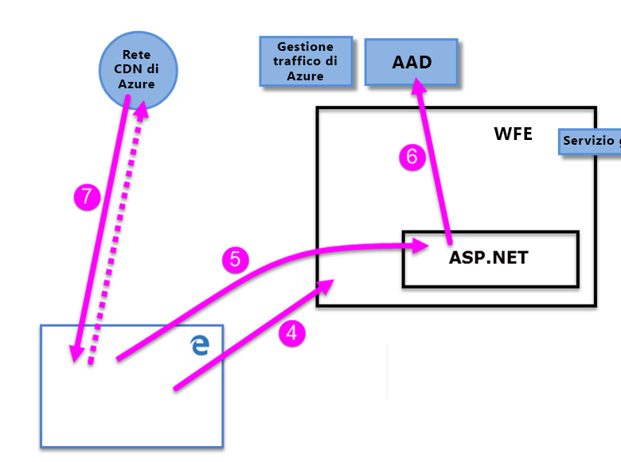

# White paper sulla sicurezza di Power BI

**Riepilogo:** Power BI è un servizio software in linea (*SaaS*o software as a Service) offerto da Microsoft che consente di creare in modo semplice e rapido dashboard, report, set di impostazioni e visualizzazioni di Business Intelligence self-service. Con Power BI è possibile connettersi a numerose origini dati diverse, combinare e definire le proprietà della forma dei dati provenienti dalle connessioni, quindi creare report e dashboard che possono essere condivisi con altri utenti.

**Writer:** David iseminger

**Revisori tecnici:** Pedrat Rezaei, Cristian Petculescu, Siva Harinath, Tod Manning, Haydn Richardson, Adam Wilson, ben Childs, Robert Bruckner, Sergei Gundorov, Kasper de Jonge

**Si applica a:** Power BI SaaS, Power BI Desktop, Power BI Embedded, Power BI Premium

> [!NOTE]
> È possibile salvare o stampare questo white paper selezionando **Stampa** dal browser, quindi selezionando **Salva come PDF**.

## Introduzione

**Power BI** è un servizio software online (_SaaS_, Software as a Service) offerto da Microsoft che consente di creare in modo semplice e rapido dashboard, report, set di dati e visualizzazioni di business intelligence in modalità self-service. Con Power BI è possibile connettersi a numerose origini dati diverse, combinare e definire le proprietà della forma dei dati provenienti dalle connessioni, quindi creare report e dashboard che possono essere condivisi con altri utenti.

Il servizio Power BI è disciplinato dalle [Condizioni di Microsoft Online Services](https://www.microsoftvolumelicensing.com/DocumentSearch.aspx?Mode=3&amp;DocumentTypeId=31) e dall'[Informativa sulla privacy di Microsoft](https://www.microsoft.com/privacystatement/OnlineServices/Default.aspx). Per la posizione di elaborazione dei dati, fare riferimento alle condizioni sulla posizione di elaborazione dei dati nelle Condizioni di Microsoft Online Services. Per informazioni sulla conformità, il [Centro protezione Microsoft](https://www.microsoft.com/trustcenter) rappresenta la risorsa principale per Power BI. Il team di Power BI si sta impegnando per offrire ai propri clienti innovazioni più recenti e produttività. Power BI è attualmente nel livello D del [Framework di conformità di Office 365](https://download.microsoft.com/download/1/4/3/1434ABAB-B8E9-412D-8C3A-187B5FCB7A2F/Compliance%20Framework%20document.pdf).

Questo articolo descrive la sicurezza di Power BI illustrando l'architettura di Power BI, la modalità di autenticazione degli utenti per Power BI e di creazione delle connessioni dati e infine descrivendo in che modo Power BI archivia e trasferisce i dati attraverso il servizio. L'ultima sezione è dedicata alle domande sulla sicurezza e alle relative risposte.

## Architettura di Power BI

Il servizio **Power BI** è basato su **Azure**, la [piattaforma di cloud computing](https://azure.microsoft.com/overview/what-is-azure/) Microsoft. Power BI è attualmente distribuito in numerosi data center nel mondo. Per i clienti sono disponibili diverse distribuzioni attive nelle aree servite dai data center e un numero equivalente di distribuzioni passive che svolgono la funzione di backup per ogni distribuzione attiva.

Ogni distribuzione di Power BI è costituita da due cluster: un cluster Web Front End (**WFE**) e un cluster **Back-End**. I due cluster sono illustrati nell'immagine seguente e offrono lo sfondo per la parte rimanente di questo articolo. 

Power BI usa Azure Active Directory (**AAD**) per l'autenticazione e la gestione degli account. Power BI usa anche **Gestione traffico di Microsoft Azure** per indirizzare il traffico utente al data center più vicino, determinato dal record DNS del client che sta provando a connettersi, per il processo di autenticazione e per scaricare il contenuto e i file statici. Power BI usa la WFE geograficamente più vicina per distribuire in modo efficiente il contenuto e i file statici necessari agli utenti, ad eccezione degli oggetti visivi personalizzati che vengono recapitati tramite la rete per la **distribuzione di contenuti (CDN) di Azure**.

### Cluster Web front-end

Il cluster **WFE** gestisce il processo di autenticazione e connessione iniziale per Power BI, usando AAD per autenticare i client e fornire i token per le successive connessioni del client al servizio Power BI.

Quando gli utenti provano a connettersi al servizio Power BI, il servizio DNS del client può comunicare con **Gestione traffico di Microsoft Azure** per trovare il data center più vicino con una distribuzione di Power BI. Per altre informazioni su questo processo, vedere [Metodi di routing di Gestione traffico](https://azure.microsoft.com/documentation/articles/traffic-manager-routing-methods/#performance-traffic-routing-method).

Il cluster Web front-end più vicino all'utente gestisce la sequenza di accesso e autenticazione (descritta più avanti in questo articolo) e fornisce un token di AAD all'utente dopo l'autenticazione. Il componente ASP.NET all'interno del cluster Web front-end analizza la richiesta per determinare a quale organizzazione appartiene l'utente, e quindi consulta il **servizio globale** di Power BI. Il servizio globale è una singola tabella di Azure condivisa tra tutti i cluster WFE e back-end a livello mondiale che esegue il mapping degli utenti e delle organizzazioni dei clienti al data center in cui si trova il tenant di Power BI. Il cluster WFE specifica nel browser il cluster back-end in cui si trova il tenant dell'organizzazione. Dopo l'autenticazione dell'utente, le interazioni client successive vengono effettuate direttamente con il cluster back-end senza l'intermediazione del cluster WFE per le richieste.

### Cluster back-end di Power BI

Il cluster **Back End** consente ai client autenticati di interagire con il servizio Power BI. Il cluster **Back-End** gestisce le visualizzazioni, i dashboard utente, i set di dati, i report, l'archiviazione dei dati, le connessioni dati, l'aggiornamento dei dati e altri aspetti dell'interazione con il servizio Power BI.

Il **ruolo Gateway** funge da gateway tra le richieste degli utenti e il servizio Power BI. Gli utenti non interagiscono direttamente con ruoli diversi dal ruolo Gateway.

**Importante:** È fondamentale notare che _solo_ i ruoli di gestione API di Azure (**gestione API**) e gateway (**GW**) sono accessibili tramite la rete Internet pubblica. Forniscono l'autenticazione, l'autorizzazione, la protezione DDoS, la limitazione delle richieste, il bilanciamento del carico, il routing e altre funzionalità.

La linea tratteggiata nell'immagine del cluster **back-end** riportata sopra indica il limite tra gli unici due ruoli accessibili dagli utenti (a sinistra della linea tratteggiata) e i ruoli accessibili solo da parte del sistema. Quando un utente autenticato si connette al servizio Power BI, la connessione e qualsiasi richiesta del client vengono accettate e gestite dal **ruolo Gateway** e da **Gestione API di Azure**, che a sua volta interagisce per conto dell'utente con la parte rimanente del servizio Power BI. Ad esempio, quando un client prova a visualizzare un dashboard, il **ruolo Gateway** accetta la richiesta e quindi invia separatamente una richiesta al **ruolo Presentation** per recuperare i dati necessari a eseguire il rendering del dashboard nel browser.

### Power BI Premium

**Power BI Premium** offre un'area di lavoro del servizio dedicata, con provisioning e partizionata per i sottoscrittori che necessitano di risorse dedicate alle proprie attività di Power BI. Quando un cliente effettua l'iscrizione per una sottoscrizione Power BI Premium, la capacità Premium viene creata tramite **Azure Resource Manager**. L'implementazione della sottoscrizione assegna un set di macchine virtuali commisurato al livello della sottoscrizione nel data center in cui è ospitato il tenant di Power BI (con l'eccezione degli ambienti multi-geografici come descritto più avanti in questo documento), inizializzato come distribuzione di **Azure Service Fabric**.

Dopo la creazione, tutte le comunicazioni con il cluster Premium vengono instradate tramite il cluster back-end di Power BI, dove viene stabilita una connessione alle macchine virtuali della sottoscrizione **Power BI Premium** dedicata del client.

### Architettura dell'archiviazione dati

Power BI usa due repository principali per l'archiviazione e la gestione dei dati: i dati caricati degli utenti vengono in genere inviati all'archiviazione **BLOB di Azure** e tutti i metadati e gli artefatti del sistema vengono archiviati, protetti da un firewall, nel **database SQL di Azure**.

Ad esempio, quando un utente importa una cartella di lavoro di Excel nel servizio Power BI, viene creato un database tabulare di Analysis Services in memoria e i dati vengono archiviati in memoria per un massimo di un'ora (o fino a quando si verifica un utilizzo elevato di memoria nel sistema). I dati vengono inviati anche all'archiviazione **BLOB di Azure**.

I metadati della sottoscrizione di Power BI di un utente, ad esempio dashboard, report, origini dati recenti, aree di lavoro, informazioni sull'organizzazione, informazioni sul tenant e altri metadati del sistema vengono archiviati e aggiornati nel **database SQL di Azure**. Tutte le informazioni archiviate nel database SQL di Azure vengono crittografate completamente usando la tecnologia [Transparent Data Encryption](https://msdn.microsoft.com/library/dn948096.aspx) (TDE) di SQL di Azure. Vengono crittografati anche tutti i dati archiviati nell'archiviazione BLOB di Azure. Altre informazioni sul processo di caricamento, archiviazione e spostamento dei dati sono disponibili nella sezione **Archiviazione dati e spostamento**.

## Creazione del tenant

Un tenant è un'istanza dedicata del servizio Azure AD ricevuta e assegnata a un'organizzazione quando questa effettua l'iscrizione a un servizio cloud Microsoft, ad esempio Azure, Microsoft Intune, Power BI oppure Office 365. Ogni tenant di Azure AD è distinto e separato dagli altri tenant di Azure AD.

Un tenant include gli utenti di un'azienda e le informazioni sugli utenti, ovvero le password, i dati di profilo utente, le autorizzazioni e così via. Il tenant include anche i gruppi, le applicazioni e altre informazioni relative all'organizzazione e alla sicurezza. Per altre informazioni, vedere [Che cos'è un tenant di Azure AD](https://msdn.microsoft.com/library/azure/jj573650.aspx#BKMK_WhatIsAnAzureADTenant).

Viene creato un tenant di Power BI nel data center ritenuto più vicino al paese o area e alle informazioni sullo stato specificate per il tenant in Azure Active Directory durante il provisioning iniziale di Office 365 o del servizio Power BI. Attualmente il tenant di Power BI non viene spostato dalla posizione del data center.

### Aree geografiche multiple (Multi-Geo)

Alcune organizzazioni necessitano della presenza di Power BI in più aree geografiche, in base alle esigenze aziendali. È possibile, ad esempio, che un'azienda abbia il proprio tenant di Power BI nel Stati Uniti, ma può anche eseguire attività in altre aree geografiche, ad esempio l'Australia, e che alcuni dati di Power BI rimangano inattivi nell'area remota per conformarsi alle normative locali. A partire dalla seconda metà del 2018, le organizzazioni con il tenant principale in una geografia possono anche effettuare il provisioning e l'accesso Power BI risorse situate in un'altra area geografica. Per ragioni di praticità e riferimento, in questo documento questa funzionalità è chiamata **Multi-Geo**.

L'articolo più recente e principale per le informazioni su più aree geografiche è l'articolo [configurare il supporto di più aree geografiche per Power bi Premium](service-admin-premium-multi-geo.md) . 

Esistono più dettagli tecnici che devono essere valutati nel contesto di leggi e normative locali quando operano in aree geografiche diverse. Questi dettagli includono quanto segue:

- Un livello di esecuzione della query remota è ospitato nell'area di capacità remota, per garantire che il modello di dati, le cache e la maggior parte dell'elaborazione dei dati rimangano nell'area della capacità remota. Esistono alcune eccezioni, come descritto in dettaglio nell'articolo relativo a più aree [geografiche per Power bi Premium](service-admin-premium-multi-geo.md) .
- Un testo della query memorizzato nella cache e i risultati corrispondenti archiviati in un'area remota resteranno in quest'area inattivi, mentre altri dati in transito possono andare avanti e indietro tra più aree geografiche.
- I file PBIX o XLSX pubblicati (caricati) in una capacità multi-Geo del servizio Power BI possono comportare la memorizzazione temporanea di una copia nell'archiviazione BLOB di Azure nell'area del tenant di Power BI. In tali circostanze, i dati vengono crittografati con crittografia del servizio di archiviazione di Azure (SSE) e la copia viene pianificata per Garbage Collection non appena viene completata l'elaborazione e il trasferimento di contenuto del file nell'area remota. 
- Quando si trasferiscono i dati tra aree geografiche in un ambiente con più aree geografiche, l'istanza dei dati nell'area di origine verrà eliminata entro 7-30 giorni. 

### Data center e impostazioni locali

Power BI è disponibile in determinate aree geografiche in base alla distribuzione dei cluster di Power BI nei data center delle aree. Microsoft prevede di espandere l'infrastruttura di Power BI in ulteriori data center.

I collegamenti seguenti offrono informazioni aggiuntive sui data center di Azure.

- [Aree di Azure](https://azure.microsoft.com/regions/): informazioni sulla presenza globale di Azure e le posizioni
- [Servizi di Azure per area](https://azure.microsoft.com/regions/#services): elenco completo dei servizi di Azure (servizi infrastruttura e piattaforma) resi disponibili da Microsoft in ogni area.

Attualmente, il servizio Power BI è disponibile in aree specifiche, gestito da Data Center, come descritto nel [Centro protezione Microsoft](https://www.microsoft.com/TrustCenter/CloudServices/business-application-platform/data-location). Il collegamento riportato di seguito illustra una mappa dei data center di Power BI; è possibile posizionarsi su un'area per visualizzare i data center presenti:

* [Data center di Power BI](https://www.microsoft.com/TrustCenter/CloudServices/business-application-platform/data-location)

Microsoft offre anche data center per cloud sovrani. Per altre informazioni sulla disponibilità del servizio Power BI per i cloud nazionali, vedere [Cloud nazionali di Power BI](https://powerbi.microsoft.com/clouds/).

Per altre informazioni su dove vengono archiviati i dati e su come vengono usati, fare riferimento al [Centro protezione Microsoft](https://www.microsoft.com/TrustCenter/Transparency/default.aspx#_You_know_where). Le direttive sulla posizione di archiviazione dei dati inattivi dei clienti sono specificate nei **Data Processing Terms** (Condizioni dell'elaborazione dati) dei [Microsoft Online Services Terms](https://www.microsoftvolumelicensing.com/DocumentSearch.aspx?Mode=3&amp;DocumentTypeId=31) (Condizioni dei servizi online Microsoft).

## Autenticazione dell'utente

L'autenticazione utente per il servizio Power BI è costituita da una serie di richieste, risposte e operazioni di reindirizzamento tra il browser dell'utente e il servizio Power BI o i servizi di Azure usati da Power BI. Tale sequenza descrive il processo di autenticazione dell'utente in Power BI. Per altre informazioni sulle opzioni per i modelli di autenticazione utente di un'organizzazione (i modelli di accesso), vedere [Choosing a sign-in model for Office 365](https://blogs.office.com/2014/05/13/choosing-a-sign-in-model-for-office-365/) (Scelta di un modello di accesso per Office 365).

### Sequenza di autenticazione

La sequenza di autenticazione utente per il servizio Power BI avviene come descritto nella procedura e nelle immagini seguenti.

1. L'utente avvia una connessione al servizio Power BI da un browser, digitando l'indirizzo di Power BI nella barra degli indirizzi (ad esempio https://app.powerbi.com) o selezionando _Accesso_ dalla pagina di destinazione di Power BI (https://powerbi.microsoft.com). La connessione si stabilisce tramite TLS 1.2 e HTTPS e tutte le comunicazioni successive tra il browser e il servizio Power BI usano il protocollo HTTPS. La richiesta viene inviata alla **Gestione traffico di Microsoft Azure**.

2. **Gestione traffico** controlla il record DNS dell'utente per determinare il data center più vicino in cui Power BI viene distribuito e risponde al DNS con l'indirizzo IP del cluster front-end Web a cui deve essere inviato l'utente.

3. Il front-end Web reindirizza poi l'utente alla pagina di accesso di Microsoft Online Services.

    

1. Quando l'utente viene autenticato, la pagina di accesso lo reindirizza al **cluster front-end Web** del servizio Power BI più vicino determinato in precedenza.

2. Il browser invia un cookie che è stato ottenuto dall'accesso con esito positivo a Microsoft Online Services, che viene controllato dal **Servizio ASP.NET** nel **cluster front-end Web**.

3. Il cluster front-end Web esegue un controllo con il servizio **Azure Active Directory** (**AAD**) per autenticare la sottoscrizione del servizio Power BI dell'utente e per ottenere un token di sicurezza AAD. Quando AAD conferma l'autenticazione dell'utente e restituisce un token di sicurezza AAD, il cluster front-end Web consulta il **servizio globale**** Power BI** che gestisce un elenco dei tenant e delle posizioni cluster Power BI back-end relative, e determina quale cluster del servizio Power BI contiene il tenant dell'utente. Il cluster front-end Web indirizza l'utente al cluster di Power BI in cui risiede il tenant e restituisce una raccolta di elementi per il browser dell'utente:

      - Il **token di sicurezza di AAD**
      - **Informazioni sulla sessione**
      - L'indirizzo Web del cluster **back-end** con cui l'utente può comunicare e interagire

1. In seguito, il browser dell'utente contatta la rete CDN di Azure specificata o, per alcuni file, il front-end Web, per scaricare la raccolta di file comuni specifici, necessari per consentire l'interazione del browser con il servizio Power BI. Per l'intera durata della sessione del browser del servizio Power BI, la pagina del browser include quindi il token AAD, le informazioni sulla sessione, il percorso del cluster back-end associato e la raccolta di file scaricati dalla rete CDN di Azure e dal cluster Web front-end.

Dopo aver completato tali elementi, il browser avvia il contatto con il cluster back-end specificato e si avvia l'interazione dell'utente con il servizio Power BI. Da questo momento, tutte le chiamate al servizio Power BI avvengono con il cluster back-end specificato e tutte le chiamate includono il token AAD dell'utente. Il token AAD ha un timeout di un'ora. Se una sessione utente rimane aperta, per mantenere l'accesso il front-end Web aggiorna periodicamente il token.

## Archiviazione e spostamento dei dati

Nel servizio Power BI i dati possono essere _inattivi_, ovvero dati disponibili per un utente di Power BI che non sono attualmente usati, oppure _in elaborazione_, come ad esempio query in esecuzione, connessioni dati e modelli in uso, dati e/o modelli in fase di caricamento nel servizio Power BI e oggetto di altre azioni che gli utenti o il servizio Power BI possono eseguire sui dati cui hanno accesso o che stanno aggiornando. I dati usati nei vari processi sono detti _dati in fase di elaborazione_. I dati inattivi in Power BI sono crittografati. Anche i dati in transito, ovvero i dati inviati o ricevuti dal servizio Power BI, sono crittografati.

Il servizio Power BI gestisce i dati in modo diverso a seconda che siano accessibili con **DirectQuery** o tramite importazione. Quindi esistono due categorie di dati utente per Power BI: dati a cui si accede da DirectQuery e dati a cui non si accede da DirectQuery.

**DirectQuery** consente di generare query utente di Power BI convertendole dal linguaggio DAX (Data Analysis Expressions) di Microsoft, ovvero il linguaggio di programmazione usato da Power BI e da altri prodotti Microsoft per generare query, nel linguaggio nativo dell'origine dati, come ad esempio T-SQL o altri linguaggi di database nativi. I dati associati con DirectQuery vengono archiviati solo come riferimento, quindi i dati di origine non vengono archiviati in Power BI quando DirectQuery non è attivo, fatto salvo per i dati di visualizzazione usati per visualizzare dashboard e report, come descritto in seguito nella sezione _Dati in fase di elaborazione (spostamento dei dati)_ . Vengono invece archiviati i riferimenti ai dati di DirectQuery che consentono di accedere ai dati durante l'esecuzione di DirectQuery. DirectQuery contiene tutte le informazioni necessarie per eseguire la query, tra cui la stringa di connessione e le credenziali usate per accedere alle origini dati, che consentono a DirectQuery di connettersi alle origini dati incluse per l'aggiornamento automatico. Con DirectQuery, le informazioni sul modello di dati sottostanti vengono incorporate in DirectQuery.

Una query per un seti di dati di importazione è costituita da una raccolta di query DAX che _non_ vengono convertite direttamente nel linguaggio nativo dell'origine dati sottostante. Le query di importazione non includono le credenziali per i dati sottostanti e i dati sottostanti vengono caricati nel servizio Power BI a meno che non si tratti di dati locali accessibili tramite [Power BI Gateway](service-gateway-onprem.md), nel qual caso la query archivia solo i riferimenti ai dati locali.

La tabella seguente descrive i dati di Power BI in base al tipo di query in uso. Una **X** indica la presenza di dati di Power BI quando si usa il tipo di query associata.

|  |Importa  |DirectQuery  |Live Connect  |
|---------|---------|---------|---------|
|Schema     |     X    |    X     |         |
|Riga di dati     |    X     |         |         |
|Memorizzazione nella cache di dati di oggetti visivi     |    X     |     X    |    X     |

La distinzione tra DirectQuery e le altre query determina come il servizio Power BI gestisce i dati inattivi e indica se la query è crittografata. Le sezioni seguenti descrivono i dati inattivi e in movimento e illustrano il processo di crittografia, la posizione e il processo per la gestione dei dati.

### Dati inattivi

Quando i dati sono inattivi, il servizio Power BI archivia set di dati, report e riquadri di dashboard nei modi descritti nelle sottosezioni seguenti. Come illustrato in precedenza, i dati inattivi in Power BI sono crittografati. Nelle sezioni seguenti ETL è l'acronimo di estrazione, trasformazione e caricamento.

#### Chiavi di crittografia

- Le chiavi di crittografia per le chiavi dei BLOB di Azure vengono archiviate e crittografate in Azure Key Vault.
- Le chiavi di crittografia per la tecnologia TDE del database SQL di Azure sono gestite dal database SQL di Azure stesso.
- La chiave di crittografia per il servizio di spostamento dei dati e il gateway di dati in locale viene archiviata:
  - Nel gateway dati locale nell'infrastruttura del cliente, per le origini dati locali
  - Nel ruolo spostamento dati, per le origini dati basate su cloud

La chiave di crittografia del contenuto (CEK) usata per crittografare l'archivio BLOB Microsoft Azure è una chiave a 256 bit generata in modo casuale. L'algoritmo che la chiave di crittografia del contenuto usa per crittografare il contenuto è AES\_CBC\_256.

La chiave di crittografia delle chiavi usata per crittografare la chiave di crittografia del contenuto è una chiave predefinita a 256 bit. L'algoritmo usato dalla chiave di crittografia delle chiavi per crittografare la chiave di crittografia del contenuto è A256KW.

Le chiavi di crittografia del gateway basate sulla chiave di ripristino non lasciano mai l'infrastruttura locale. Power BI non può accedere ai valori delle credenziali locali crittografate e non può intercettarle. I client Web crittografano le credenziali con una chiave pubblica associata al gateway specifico con cui stanno comunicando.

Per le origini dati basate su cloud, il ruolo di spostamento dei dati consente di crittografare le chiavi di crittografia usando i metodi [Always Encrypted](https://msdn.microsoft.com/library/mt163865.aspx). Per altre informazioni, vedere [Always Encrypted (motore di database)](https://msdn.microsoft.com/library/mt163865.aspx).

#### Datasets

1. Metadati (tabelle, colonne, misure, calcoli, stringhe di connessione e così via)

    a. Per Analysis Services locale non viene archiviato niente nel servizio, ad eccezione di un riferimento al database crittografato archiviato in Azure SQL.

    b. Tutti gli altri metadati per ETL, DirectQuery e dati di push vengono crittografati e archiviati nell'Archiviazione BLOB di Azure.

1. Credenziali per le origini dati originali
  
      a. Analysis Services locale: le credenziali non sono richieste e quindi non vengono archiviate.

      b. DirectQuery: dipende dal fatto che il modello venga creato direttamente nel servizio, e in questo caso memorizzato nella stringa di connessione e crittografato in Archiviazione BLOB di Azure, piuttosto che importato da Power BI Desktop, che prevede la memorizzazione delle credenziali crittografate nel database SQL di Azure usato per lo spostamento dati. La chiave di crittografia viene archiviata nel computer che esegue il gateway nell'infrastruttura del cliente.

      c. Push dei dati: non applicabile

      d. ETL

      - Per **Salesforce** o **OneDrive**: i token di aggiornamento vengono archiviati crittografati nel database SQL di Azure del servizio Power BI.
      - In caso contrario:
        - Se il set di dati è impostato per l'aggiornamento, le credenziali vengono archiviate crittografate nel database SQL di Azure usato per lo spostamento dati. La chiave di crittografia viene archiviata nel computer che esegue il gateway nell'infrastruttura del cliente.
        - Se il set di dati non è impostato per l'aggiornamento, non sono disponibili credenziali archiviate per le origini dati

1. dati

    a. Analysis Services in locale e DirectQuery: non viene archiviato nulla nel servizio Power BI.

    b. ETL: crittografati nell'archiviazione BLOB di Azure, ma tutti i dati attualmente presenti nell'archiviazione BLOB di Azure del servizio Power BI usano la [crittografia del servizio di archiviazione di Azure](https://docs.microsoft.com/azure/storage/common/storage-service-encryption), nota anche come crittografia lato server. Anche per Multi-Geo viene usata la crittografia del servizio di archiviazione.

    c. Push dei dati v1: archiviati crittografati in Archiviazione BLOB di Azure, ma tutti i dati attualmente presenti nell'archiviazione BLOB di Azure del servizio Power BI usano la [crittografia del servizio di archiviazione di Azure](https://docs.microsoft.com/azure/storage/common/storage-service-encryption), nota anche come crittografia lato server. Anche per Multi-Geo viene usata la crittografia del servizio di archiviazione. I dati push V1 sono stati interrotti a partire da 2016. 

    d. Push dei dati v2: archiviati crittografati in Azure SQL.

Power BI usa l'approccio di crittografia lato client, usando la modalità CBC (Cipher Block Chaining) con Advanced Encryption Standard (AES), per crittografare l'archiviazione BLOB di Azure. Sono disponibili [altre informazioni sulla crittografia lato client](https://azure.microsoft.com/documentation/articles/storage-client-side-encryption/).

Power BI offre il monitoraggio dell'integrità dei dati nei modi seguenti:

* Per i dati inattivi in Azure SQL, Power BI usa dbcc, TDE e il checksum della pagina costante come parte delle funzionalità native di SQL.

* Per i dati inattivi in Archiviazione BLOB di Azure, Power BI usa la crittografia lato client e HTTPS per trasferire i dati nell'archiviazione che include controlli di integrità durante il recupero dei dati. È possibile consultare [altre informazioni sulla sicurezza di Archiviazione BLOB di Azure](https://azure.microsoft.com/documentation/articles/storage-security-guide/).

#### Relazioni

1. Metadati (definizione del report)

   a. I report possono essere report di Excel per Office 365 o report di Power BI. Per i metadati si applica quanto segue in base al tipo di report:
        
    &ensp; &ensp;. I metadati del rapporto di Excel vengono archiviati crittografati in SQL Azure. I metadati vengono archiviati anche in Office 365.

    &ensp; &ensp; b. I report Power BI vengono archiviati crittografati nel database SQL di Azure.

2. Dati statici

   I dati statici includono elementi come immagini di sfondo e oggetti visivi personalizzati.

    &ensp; &ensp;. Per i report creati con Excel per Office 365, non viene memorizzato alcun valore.

    &ensp; &ensp; b. Per i report di Power BI, i dati statici vengono archiviati e crittografati in Archiviazione BLOB di Azure.

3. cache

    &ensp; &ensp;. Per i report creati con Excel per Office 365, nella cache non viene memorizzato alcun valore.

    &ensp; &ensp; b. Per i report di Power BI, i dati relativi agli oggetti visivi presenti vengono memorizzati nella cache crittografati nel database SQL di Azure.
 

4. File originali di Power BI Desktop (PBIX) o Excel (XLSX) pubblicati in Power BI

    A volte viene archiviata una copia o una copia shadow dei file PBIX o XLSX in Archiviazione BLOB di Azure di Power BI e, in questo caso, i dati vengono crittografati. Tutti i report di questo tipo archiviati nel servizio Power BI, in Archiviazione BLOB di Azure, usano la [crittografia del servizio di archiviazione di Azure](https://docs.microsoft.com/azure/storage/common/storage-service-encryption), nota anche come crittografia lato server. Anche per Multi-Geo viene usata la crittografia del servizio di archiviazione.

#### Dashboard e riquadri del dashboard

1. Cache: i dati necessari per gli oggetti visivi nel dashboard in genere vengono memorizzati nella cache e archiviati crittografati nel database SQL di Azure. Altri riquadri, ad esempio gli oggetti visivi aggiunti da Excel o SQL Server Reporting Services, vengono archiviati in BLOB di Azure come immagini e vengono anche crittografati.

2. Dati statici: includono artefatti come le immagini di sfondo e gli oggetti visivi personalizzati, che vengono archiviati e crittografati in Archiviazione BLOB di Azure.

Indipendentemente dal metodo di crittografia in uso, Microsoft gestisce la crittografia delle chiavi per conto dei clienti, in un archivio segreto o in Azure Key Vault.

### Dati archiviati Transiently temporaneamente in dispositivi non volatili

I dispositivi non volatili sono dispositivi che hanno memoria che viene mantenute senza alimentazione costante. Di seguito vengono descritti i dati che vengono temporaneamente archiviati nei dispositivi non volatili. 

#### Datasets

1. Metadati (tabelle, colonne, misure, calcoli, stringhe di connessione e così via)

2. Alcuni artefatti correlati agli schemi possono essere archiviati sul disco dei nodi di calcolo per un periodo di tempo limitato. Alcuni artefatti possono essere archiviati anche nella cache REDIS di Azure non crittografati per un periodo di tempo limitato.

3. Credenziali per le origini dati originali

    a. Analysis Services locale: non vengono memorizzati valori

    b. DirectQuery: dipende dal fatto che il modello venga creato direttamente nel servizio, e in questo caso memorizzato nella stringa di connessione in formato crittografato, con chiave di crittografia archiviata non crittografata nello stesso posto (insieme alle informazioni crittografate) o che il modello venga importato da Power BI Desktop e in questo caso le credenziali non vengono archiviate nei dispositivi non volatili.

    > [!NOTE]
    > La funzionalità di creazione del modello sul lato servizio non è più disponibile a partire da 2017.

    c. Push dei dati: nessuno (non applicabile)

    d. ETL: nessuno (non vengono archiviati dati nel nodo di calcolo né in modo diverso da quello illustrato nella sezione relativa ai **dati inattivi**)
4. dati

    Alcuni artefatti di dati possono essere archiviati sul disco dei nodi di calcolo per un periodo di tempo limitato.

### Dati in fase di elaborazione

I dati sono in fase di elaborazione quando un utente li usa o vi accede attivamente. Ad esempio, i dati sono in fase di elaborazione quando un utente accede a un set di dati, esegue la revisione o la modifica un dashboard o un report, quando si verificano aggiornamenti o altre attività di accesso ai dati. Se si verifica uno di questi eventi e viene avviata l'elaborazione dei dati, il **ruolo dati** nel servizio Power BI crea un database di Analysis Services in memoria e il set di dati viene caricato in quel database di Analysis Services in memoria. A seconda se il set di dati è basato su DirectQuery o meno, i dati caricati nel database di Analysis Services non sono crittografati per consentire l'accesso da parte del **ruolo dati** e vengono mantenuti in memoria per consentire ancora l'accesso finché il set di dati non è più necessario per il servizio Power BI. Per i clienti con una sottoscrizione Power BI Premium, Power BI crea un database di Analysis Services in memoria nella raccolta del cliente di macchine virtuali di Power BI con provisioning separato.

Quando si usano i dati, incluso il caricamento iniziale dei dati in Power BI, il servizio Power BI può memorizzare nella cache i dati di visualizzazione in un **database SQL di Azure** crittografato, indipendentemente dal fatto che il set di dati sia basato su DirectQuery.

Per monitorare l'integrità dei dati per i dati in fase di elaborazione, Power BI usa HTTPS, TCP/IP e TLS per verificare che i dati siano crittografati e mantiene l'integrità durante il trasporto.

## Autenticazione dell'utente per le origini dati

Con ogni origine dati, un utente stabilisce una connessione in base al relativo account di accesso e accede ai dati con tali credenziali. Gli utenti possono quindi creare query, dashboard e report basati sui dati sottostanti.

Quando un utente condivide query, dashboard, report o una visualizzazione, l'accesso a tali dati e visualizzazioni dipende dal fatto che le origini dati sottostanti supportino o meno la sicurezza a livello di ruolo.

Se un'origine dati sottostante supporta la **sicurezza a livello di ruolo di Power BI***** , il servizio Power BI applica la sicurezza a livello di ruolo e gli utenti che non hanno credenziali sufficienti per accedere ai dati sottostanti, ad esempio una query usata in un dashboard, report o altro artefatto di dati, non visualizzeranno i dati per i quali non hanno privilegi sufficienti. Se l'accesso di un utente ai dati sottostanti è diverso dall'utente che ha creato il dashboard o il report, le visualizzazioni e altri artefatti visualizzeranno solo i dati basati sul livello di accesso dell'utente ai dati.

Se un'origine dati **non** applica la sicurezza a livello di ruolo, le credenziali di accesso di Power BI vengono applicate all'origine dati sottostante o, se vengono specificate altre credenziali durante la connessione, vengono applicate le credenziali specificate. Quando un utente carica i dati nel servizio Power BI da origini dati senza sicurezza a livello di ruolo, i dati vengono archiviati in Power BI come descritto nella sezione relativa ad **archiviazione e spostamento dei dati** in questo documento. Per le origini dati senza sicurezza a livello di ruolo, quando i dati vengono condivisi con altri utenti, ad esempio in un dashboard o report, o si verifica un aggiornamento dei dati, vengono usate le credenziali originali per accedere o visualizzare i dati.

Per un rapido esempio delle differenze tra origini dati con e senza sicurezza a livello di ruolo, si immagini che Sam crei un report e un dashboard e li condivida con Abby e Ralph. Se le origini dati usate nel report e nel dashboard derivano da origini dati che **non** supportano la sicurezza a livello di ruolo, sia Abby che Ralph saranno in grado di visualizzare i dati che Sam ha incluso nel dashboard (caricato nel servizio Power BI) e sia Abby che Ralph possono interagire con i dati. Al contrario, se Sam crea un report e un dashboard da origini dati che supportano la sicurezza a livello di ruolo e li condivide con Abby e Ralph, quando Abby tenta di visualizzare il dashboard avviene quanto segue:

1. Poiché il dashboard deriva da un'origine dati con sicurezza a livello di ruolo, nelle visualizzazioni del dashboard appare brevemente un messaggio relativo al &quot;caricamento&quot; mentre il servizio Power BI esegue una query sull'origine dati per recuperare il set di dati corrente, specificato nella stringa di connessione associata alla query sottostante del dashboard.

2. L'accesso e il recupero dei dati vengono effettuati in base alle credenziali e al ruolo di Abby e solo i dati per cui Abby ha autorizzazioni sufficienti vengono caricati nel dashboard e nel report.

3. Le visualizzazioni nel dashboard e nel report vengono visualizzate in base al livello di ruolo di Abby.

Se Ralph deve accedere al dashboard o report condiviso, si verifica la stessa sequenza in base al suo livello di ruolo.

## Power BI per dispositivi mobili

Power BI mobile è una raccolta di app progettate per le tre piattaforme per dispositivi mobili principali: Android, iOS e Windows Mobile. Le considerazioni sulla sicurezza per le app Power BI per dispositivi mobili rientrano in due categorie:

* Comunicazione del dispositivo
* Applicazione e dati nel dispositivo

Per quanto riguarda la **comunicazione del dispositivo**, tutte le applicazioni Power BI per dispositivi mobili comunicano con il servizio Power BI e usano le stesse sequenze di autenticazione e connessione usate dai browser descritte in dettaglio in precedenza in questo white paper. Le applicazioni Power BI per dispositivi mobili per iOS e Android aprono una sessione del browser all'interno dell'applicazione stessa, mentre l'app per dispositivi mobili Windows apre un broker per stabilire il canale di comunicazione con Power BI.

La tabella seguente elenca il supporto dell'autenticazione basata su certificati per Power BI per dispositivi mobili in base alla piattaforma del dispositivo mobile:

| **Supporto dell'autenticazione basata su certificati** | **iOS** | **Android** | **Windows** |
| --- | --- | --- | --- |
| **Power BI** (accesso al servizio) | Supportato | Supportato | Non supportato |
| **File system distribuito di Azure SSRS** (connessione al server SSRS) | Non supportato | Supportato | Non supportato |

Le app Power BI per dispositivi mobili comunicano attivamente con il servizio Power BI. Per raccogliere statistiche sull'utilizzo delle app per dispositivi mobili e dati simili per la trasmissione a servizi di monitoraggio dell'utilizzo e dell'attività, viene usata la telemetria. Con i dati di telemetria non vengono inviati dati personali dell'utente.

L'**applicazione Power BI nel dispositivo** archivia all'interno di questo i dati che facilitano l'uso dell'app:

* I token di Azure Active Directory e di aggiornamento vengono archiviati in un meccanismo protetto nel dispositivo applicando misure di sicurezza standard di settore.

* I dati vengono memorizzati in una risorsa di archiviazione del dispositivo non crittografata direttamente dall'applicazione stessa

* Le impostazioni vengono archiviate anch'esse, non crittografate, nel dispositivo, ma non vengono archiviati dati utente veri e propri.

La cache dei dati di Power BI per dispositivi mobili rimane nel dispositivo per due settimane o finché l'app non viene rimossa, l'utente non si disconnette da Power BI per dispositivi mobili o l'utente non riesce ad accedere, ad esempio in caso di scadenza del token o di modifica della password. La cache dei dati include i dashboard e i report a cui l'utente ha effettuato l'accesso in precedenza dall'app Power BI per dispositivi mobili.

Le applicazioni Power BI per dispositivi mobili non esaminano le cartelle nel dispositivo. 

Tutte e tre le piattaforme per cui Power BI per dispositivi mobili è disponibile supportano Microsoft Intune, un servizio software che consente la gestione delle applicazioni e dei dispositivi mobili. Se il servizio Intune è abilitato e configurato, i dati nel dispositivo mobile vengono crittografati e l'applicazione Power BI non può essere installata in una scheda SD. Sono disponibili [altre informazioni su Microsoft Intune](https://www.microsoft.com/cloud-platform/microsoft-intune).

## Domande e risposte sulla sicurezza di Power BI

Di seguito sono riportate domande comuni sulla sicurezza e le relative risposte per Power BI. Le domande sono organizzate in base all'ordine cronologico in cui sono state aggiunte al presente white paper, per consentire una maggiore rapidità nella ricerca delle nuove domande e risposte quando il white paper viene aggiornato. Le domande più recenti vengono aggiunte alla fine dell'elenco.

**In che modo gli utenti possono connettersi e ottenere l'accesso alle origini dati con Power BI?**

* Credenziali **Power bi e credenziali di dominio:** Gli utenti possono accedere a Power BI usando un indirizzo di posta elettronica; Quando un utente tenta di connettersi a una risorsa di dati, Power BI passa l'indirizzo di posta elettronica di accesso Power BI come credenziali. Per le risorse connesse a un dominio (locale o basato sul cloud), l'indirizzo di posta elettronica di accesso viene associato a un _nome dell'entità utente_ ([UPN](https://msdn.microsoft.com/library/windows/desktop/aa380525(v=vs.85).aspx)) dal servizio directory per determinare se sono presenti credenziali sufficienti per consentire l'accesso. Per le organizzazioni che accedono a Power BI tramite indirizzi di posta elettronica di lavoro (gli stessi usati per accedere alle risorse di lavoro, ad esempio _david@contoso.com_ ), il mapping avviene facilmente. Per le organizzazioni che non usano indirizzi di posta elettronica di lavoro (ad esempio _david@contoso.onmicrosoft.com_ ), per consentire l'accesso alle risorse locali con le credenziali di accesso di Power BI è necessario definire il mapping della directory.

* **SQL Server Analysis Services e Power bi:** Per le organizzazioni che usano SQL Server Analysis Services locali, Power BI offre il Power BI gateway dati locale, ovvero un **gateway**, come a cui si fa riferimento nelle sezioni precedenti.  Il gateway dati locale di Power BI è in grado di applicare la sicurezza a livello di ruolo sulle origini dati. Per altre informazioni sulla sicurezza a livello di ruolo, vedere **Autenticazione utente alle origini dati** più indietro in questo documento. Per altre informazioni sui gateway, vedere [gateway dati locale](service-gateway-onprem.md).

  Le organizzazioni possono anche usare Kerberos per **l'accesso Single Sign-On** (SSO) e connettersi in modo semplice da Power BI a origini dati locali, ad esempio SQL Server, SAP HANA e Teradata. Per altre informazioni e per i requisiti di configurazione specifici, vedere [ **Usare Kerberos per SSO da Power BI alle origini dati locali**](https://docs.microsoft.com/power-bi/service-gateway-kerberos-for-sso-pbi-to-on-premises-data).

* **Connessioni non di dominio**: per le connessioni dati non appartenenti a un dominio e che non sono idonee per la sicurezza a livello di ruolo, l'utente deve fornire le credenziali durante la sequenza di connessione, che Power bi quindi passa all'origine dati per stabilire la connessione. Se le autorizzazioni sono sufficienti, i dati vengono caricati dall'origine dati nel servizio Power BI.

**Come vengono trasferiti i dati in Power BI?**

* Per la connessione dall'origine dati al servizio Power BI, tutti i dati richiesti e trasmessi da Power BI vengono crittografati in transito con il protocollo HTTPS. Viene stabilita una connessione sicura con il provider di dati e i dati passano attraverso la rete solo dopo che tale connessione è stata stabilita.

**In che modo Power BI memorizza nella cache i dati dei report, dei dashboard o dei modelli? Tale memorizzazione è sicura?**

* Quando si accede a un'origine dati, il servizio Power BI esegue il processo descritto nella sezione **Archiviazione e spostamento dei dati**più indietro in questo documento.

**I client memorizzano i dati delle pagine Web nella cache locale?**

* Quando i browser dei client accedono a Power BI, i server Web di Power BI impostano la direttiva _Cache-Control_ su _no-store_. La direttiva _no-store_ indica al browser di non memorizzare nella cache la pagina Web visualizzata dall'utente e di non archiviare la pagina Web nella cartella della cache del client.

**Per quanto riguarda la sicurezza basata sui ruoli, la condivisione di report o dashboard e connessioni dati? In che modo funziona in termini di accesso ai dati, visualizzazione del dashboard, accesso ai report o aggiornamento?**

* Per le origini dati non abilitate per la **sicurezza a livello di ruolo**, se un dashboard, un report o un modello di dati è condiviso con altri utenti tramite Power BI, gli utenti con cui il dashboard, il report o il modello è condiviso possono visualizzare i dati contenuti e interagire con essi. Power BI *non* ripete l'autenticazione degli utenti con l'origine dati originaria. Dopo che i dati sono stati caricati in Power BI, l'utente che ha effettuato l'autenticazione con l'origine dati ha la responsabilità di gestire quali altri utenti e gruppi possono visualizzare i dati.

  Se si creano connessioni dati a un'origine dati abilitata per la **sicurezza a livello di ruolo**, ad esempio un'origine dati Analysis Services, in Power BI vengono memorizzati nella cache solo i dati del dashboard. Ogni volta che in Power BI si visualizza o si accede a un report o a un set di dati che usa i dati di un'origine dati abilitata per la sicurezza a livello di ruolo, il servizio Power BI accede all'origine dati per ottenere i dati in base alle credenziali dell'utente. Se le autorizzazioni utente sono sufficienti, i dati vengono caricati nel report o nel modello. Se l'autenticazione non riesce, l'utente visualizzerà un errore.

  Per altre informazioni, vedere la sezione **Autenticazione utente alle origini dati** più indietro in questo documento.

**Gli utenti si connettono continuamente alle stesse origini dati, alcune delle quali richiedono credenziali diverse dalle credenziali del dominio. In che modo è possibile evitare di immettere queste credenziali ogni volta che effettuano una connessione dati?**

* Power BI offre la funzionalità [Power BI Personal Gateway](https://support.powerbi.com/knowledgebase/articles/649846), che consente di creare credenziali per più origini dati diverse e quindi usare automaticamente le credenziali corrette quando si accede a ognuna di tali origini dati. Per altre informazioni, vedere [Power BI Personal Gateway](https://support.powerbi.com/knowledgebase/articles/649846).

**Come funzionano i gruppi di Power BI?**

* I gruppi di Power BI consentono di collaborare rapidamente e facilmente alla creazione di dashboard, report e modelli di dati all'interno di team definiti. Se, ad esempio, un gruppo di Power BI include tutti gli utenti del proprio team, è possibile collaborare facilmente con tutti i membri del team selezionando il gruppo all'interno di Power BI. I gruppi di Power BI sono equivalenti ai gruppi universali di Office 365 (su cui sono disponibili [altre informazioni](https://support.office.com/Article/Find-help-about-Groups-in-Office-365-7a9b321f-b76a-4d53-b98b-a2b0b7946de1) e che è possibile [creare](https://support.office.com/Article/View-create-and-delete-Groups-in-the-Office-365-admin-center-a6360120-2fc4-46af-b105-6a04dc5461c7) e [gestire](https://support.office.com/Article/Manage-Group-membership-in-the-Office-365-admin-center-e186d224-a324-4afa-8300-0e4fc0c3000a)) e usano gli stessi meccanismi di autenticazione di Azure Active Directory per la protezione dei dati. È possibile [creare gruppi in Power BI](https://support.powerbi.com/knowledgebase/articles/654250) o creare un gruppo universale nell'interfaccia di amministrazione di Microsoft 365. Con entrambi si ottiene lo stesso risultato ai fini della creazione di gruppi in Power BI.

  Si noti che per i dati condivisi con gruppi di Power BI valgono le stesse considerazioni sulla sicurezza che per i dati condivisi in Power BI. Per le origini dati **non abilitate per la sicurezza a livello di ruolo**, Power BI **non** ripete l'autenticazione degli utenti con l'origine dati originaria. Dopo che i dati sono stati caricati in Power BI, l'utente che ha effettuato l'autenticazione con l'origine dati ha la responsabilità di gestire quali altri utenti e gruppi possono visualizzare i dati. Per altre informazioni, vedere la sezione **Autenticazione utente alle origini dati** più indietro in questo documento.

  Sono disponibili altre informazioni sui [gruppi in Power BI](https://support.powerbi.com/knowledgebase/articles/654247).

**Quali porte vengono usate dal gateway dati locale e dal gateway personale? Sono presenti nomi di dominio che devono essere consentiti per finalità di connettività?**

* La risposta dettagliata a questa domanda è disponibile nel collegamento seguente: [porte del gateway](/data-integration/gateway/service-gateway-communication#ports)

**Quando si lavora con il gateway dati locale, come vengono usate le chiavi di ripristino e dove vengono archiviate? Per quanto riguarda la gestione delle credenziali sicure?**

* Durante l'installazione e la configurazione del gateway, l'amministratore digita una **chiave di ripristino** del gateway. Tale **chiave di ripristino** viene utilizzata per generare una chiave simmetrica **AES** complessa. Viene creata anche una chiave asimmetrica **RSA** .

    Queste chiavi generate (**RSA** e **AES**) vengono archiviate in un file all'interno del computer locale. Anche questo file è crittografato. Il contenuto del file può essere decrittografato solo da quel computer Windows e solo da quell'account del servizio gateway.

    Quando un utente immette le credenziali dell'origine dati nell'interfaccia utente del servizio Power BI, le credenziali vengono crittografate con la chiave pubblica nel browser. Il gateway decrittografa le credenziali usando la chiave privata RSA e le crittografa nuovamente con una chiave simmetrica AES prima che i dati vengano archiviati nel servizio Power BI. Con questo processo, il servizio Power BI non ha mai accesso ai dati non crittografati.

**Quali protocolli di comunicazione vengono usati dal gateway dati locale e come vengono protetti?**

* Il gateway supporta i due protocolli di comunicazione seguenti:

  - **AMQP 1,0 – TCP + TLS**: questo protocollo richiede che le porte 443, 5671-5672 e 9350-9354 siano aperte per le comunicazioni in uscita. Questo protocollo è preferibile, perché ha un overhead di comunicazione più basso.

  - **Https-WebSocket su HTTPS + TLS**: questo protocollo usa solo la porta 443. L'avvio di WebSocket viene attivato da un unico messaggio HTTP CONNECT. Dopo che il canale è stato stabilito, la comunicazione è essenzialmente TCP + TLS. È possibile forzare il gateway a usare questo protocollo modificando un'impostazione descritta nell' [articolo Gateway locale](/data-integration/gateway/service-gateway-communication#force-https-communication-with-azure-service-bus).

**Qual è il ruolo della Rete di distribuzione dei contenuti di Azure in Power BI?**

* Come affermato in precedenza, Power BI usa la **Rete di distribuzione dei contenuti di Azure** per distribuire in modo efficiente i file e i contenuti statici necessari agli utenti in base alle impostazioni locali geografiche. Per un livello di dettaglio maggiore, il servizio Power BI usa più **reti di distribuzione dei contenuti** per distribuire in modo efficiente i file e i contenuti statici necessari agli utenti tramite la rete Internet pubblica. I file statici includono download di prodotti (ad esempio **Power BI Desktop**, **gateway dati locale** o app Power BI da diversi provider di servizi indipendenti), file di configurazione del browser usati per avviare e stabilire le connessioni successive con il servizio Power BI, nonché la pagina iniziale di accesso protetto a Power BI.

  In base alle informazioni specificate durante la connessione iniziale al servizio Power BI, il browser dell'utente contatta la **rete di distribuzione dei contenuti** di Azure specificata (o, per alcuni file, il **WFE**) per scaricare la raccolta di file comuni specifici, necessari per consentire l'interazione del browser con il servizio Power BI. Per l'intera durata della sessione del browser del servizio Power BI, la pagina del browser include quindi il token AAD, le informazioni sulla sessione, il percorso del cluster **back-end** associato e la raccolta di file scaricati dalla rete **CDN** di Azure e dal cluster **Web front-end**.

**Per gli oggetti visivi personalizzati, Microsoft esegue valutazioni sulla sicurezza o la privacy del codice dell'oggetto visivo personalizzato prima di pubblicare gli elementi nella raccolta?**

* N. È responsabilità del cliente esaminare il codice dell'oggetto visivo personalizzato per determinare se possa essere ritenuto affidabile. L'intero codice dell'oggetto visivo personalizzato viene gestito in un ambiente sandbox per evitare che qualsiasi codice fuori controllo di un oggetto visivo personalizzato possa compromettere il resto del servizio Power BI.

**Esistono altri oggetti visivi di Power BI che inviano informazioni all'esterno della rete del cliente?**

* Sì. Gli oggetti visivi Bing Map ed ESRI trasmettono i dati degli oggetti visivi che usano tali servizi all'esterno del servizio Power BI.

**Per le app modello, Microsoft esegue una valutazione della sicurezza o della privacy dell'app modello prima di pubblicare gli elementi nella raccolta?**
* N. L'autore dell'app è responsabile del contenuto, mentre la responsabilità del cliente di rivedere e determinare se considerare attendibile l'autore dell'app modello. 

**Sono disponibili app modello in grado di inviare informazioni all'esterno della rete del cliente?**
* Sì. È responsabilità del cliente esaminare l'informativa sulla privacy dell'editore e determinare se installare l'app modello nel tenant. Inoltre, l'editore è responsabile della notifica del comportamento e delle funzionalità dell'app.

**Informazioni sulla sovranità dei dati È possibile eseguire il provisioning di tenant in data center dislocati in aree geografiche specifiche, per garantire che i dati non lascino i confini dei paesi?**

* Alcuni clienti di determinate aree geografiche hanno l'opzione di creare un tenant in un cloud nazionale, in cui le operazioni di elaborazione e archiviazione dei dati vengono mantenute separate rispetto a tutti gli altri data center. I cloud nazionali sono caratterizzati da un tipo di sicurezza leggermente diverso perché il servizio Power BI del cloud nazionale viene eseguito da un trustee dei dati separato per conto di Microsoft.

  I clienti possono anche, in alternativa, configurare un tenant in un'area specifica, sebbene tali tenant non dispongano di un trustee dei dati separato da Microsoft. Il prezzo del servizio Power BI per i cloud nazionali è diverso da quello del servizio a pagamento disponibile a livello generale. Per altre informazioni sulla disponibilità del servizio Power BI per i cloud nazionali, vedere [Cloud nazionali di Power BI](https://powerbi.microsoft.com/clouds/).

**In che modo Microsoft considera le connessioni per i clienti che hanno Power BI Premium sottoscrizioni? Le connessioni sono diverse da quelle stabilite per la servizio Power BI non Premium?**

* Le connessioni stabilite per i clienti con sottoscrizioni di Power BI Premium implementano un processo di autorizzazione [Azure B2B](https://docs.microsoft.com/azure/active-directory/active-directory-b2b-what-is-azure-ad-b2b) usando Azure Active Directory (AD) per abilitare il controllo di accesso e autorizzazione. Power BI gestisce le connessioni provenienti dai sottoscrittori di Power BI Premium verso le risorse di Power BI Premium esattamente come gestisce qualsiasi altro utente di Azure AD.

## Conclusioni

L'architettura del servizio Power BI è basata su due cluster: il cluster Web front-end (WFE) e il cluster back-end. Il cluster WFE è responsabile della connessione e dell'autenticazione iniziale al servizio Power BI e, dopo l'autenticazione, il cluster Back End gestisce tutte le successive interazioni con l'utente. Power BI usa Azure Active Directory (AAD) per archiviare e gestire le identità degli utenti e gestisce l'archiviazione di dati e metadati usando rispettivamente l'archivio BLOB di Azure e il database SQL di Azure.

L'elaborazione e l'archiviazione dei dati in Power BI variano in base al fatto che l'accesso sia avvenuto tramite DirectQuery e dipendono inoltre dal fatto che le origini dati siano locali o si trovino nel cloud. Power BI è anche in grado di attivare la sicurezza a livello di ruolo e interagisce con i gateway che forniscono l'accesso ai dati locali.

## Commenti e suggerimenti

I commenti degli utenti sono molto apprezzati. Sono graditi i suggerimenti volti a migliorare, arricchire o chiarire il contenuto di questo white paper o altro contenuto relativo a Power BI. Inviare i suggerimenti a [pbidocfeedback@microsoft.com](mailto:pbidocfeedback@microsoft.com).

## Risorse aggiuntive

Per altre informazioni su Power BI, vedere le risorse seguenti.

- [Gruppi in Power BI](https://support.powerbi.com/knowledgebase/articles/654247)
- [Introduzione a Power BI Desktop](https://support.powerbi.com/knowledgebase/articles/471664)
- [Panoramica dell'API REST di Power BI](https://msdn.microsoft.com/library/dn877544.aspx)
- [Riferimento all'API di Power BI](https://msdn.microsoft.com/library/mt147898.aspx)
- [On-premises data gateway (Gateway dati locale)](service-gateway-onprem.md)
- [Cloud nazionali di Power BI](https://powerbi.microsoft.com/clouds/)
- [Power BI Premium](https://aka.ms/pbipremiumwhitepaper)
- [Usare Kerberos per l'accesso SSO da Power BI alle origini dati locali](service-gateway-sso-overview.md)
